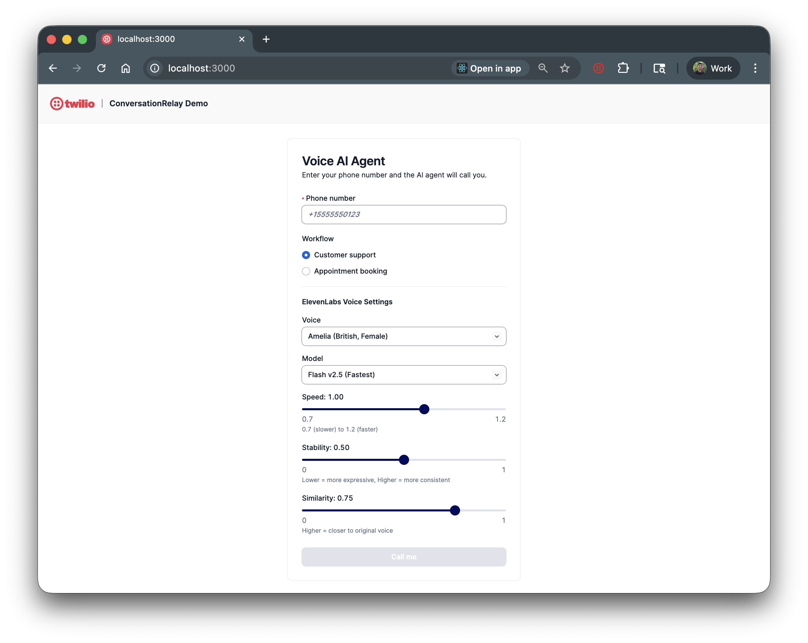

# Twilio ConversationRelay Voice AI Demo

**Build AI-powered voice agents that handle real phone conversations**

Create intelligent phone assistants using Twilio ConversationRelay, OpenAI GPT, and ElevenLabs. This template demonstrates how to build a complete voice AI system that can call users, understand their speech, respond naturally, and handle multi-turn conversations for customer support or appointment booking.



## Features

- **Real-time voice AI**: Bidirectional audio streaming via WebSocket
- **Natural conversations**: OpenAI GPT powers intelligent responses
- **Premium voices**: ElevenLabs TTS with 8 voice options and customizable parameters
- **Multiple workflows**: Customer support and appointment booking modes
- **Professional UI**: Built with Twilio Paste design system
- **Production patterns**: Session management, error handling, and clean architecture

## Prerequisites

- **Twilio Account** with a phone number and [ConversationRelay enabled](https://www.twilio.com/docs/voice/conversationrelay/onboarding)
- **OpenAI API key**
- **ngrok** (or similar tunneling service)
- **Node.js** 18+

## Quick Start

1. **Install dependencies**
   ```bash
   npm install
   ```

2. **Configure environment**
   ```bash
   cp env.example .env
   ```

3. **Edit `.env`** with your credentials:
   ```
   TWILIO_ACCOUNT_SID=ACxxxxxxxx
   TWILIO_AUTH_TOKEN=xxxxxxxx
   TWILIO_PHONE_NUMBER=+15555550123
   OPENAI_API_KEY=sk-xxxxxxxx
   NGROK_URL=your-domain.ngrok.app
   ```

4. **Start ngrok**
   ```bash
   ngrok http 3000
   ```
   Copy the domain (without `https://`) to `NGROK_URL` in `.env`.

5. **Run the app**
   ```bash
   npm run dev
   ```

6. **Test it**: Open http://localhost:3000, enter your phone number, and click "Call me".

## Environment Variables

| Variable | Required | Description |
|----------|----------|-------------|
| `TWILIO_ACCOUNT_SID` | Yes | Twilio Account SID |
| `TWILIO_AUTH_TOKEN` | Yes | Twilio Auth Token |
| `TWILIO_PHONE_NUMBER` | Yes | Your Twilio phone number |
| `OPENAI_API_KEY` | Yes | OpenAI API key |
| `NGROK_URL` | Yes | ngrok domain (without https://) |
| `OPENAI_MODEL` | No | GPT model (default: `gpt-4o-mini`) |

## How It Works

```
User Phone <-> Twilio Voice <-> ConversationRelay <-> WebSocket Server <-> OpenAI
                                      |
                                      v
                                 ElevenLabs TTS
```

1. User enters phone number in the web UI
2. Server initiates outbound call via Twilio Voice API
3. TwiML connects the call to ConversationRelay
4. ConversationRelay establishes WebSocket connection to your server
5. User speech is transcribed and sent to your WebSocket handler
6. OpenAI generates a response based on conversation history
7. Response is synthesized to speech via ElevenLabs and played to caller
8. Conversation continues until call ends

## Project Structure

```
├── server.mjs          # WebSocket server + OpenAI integration
├── pages/
│   ├── index.jsx       # React UI (Twilio Paste)
│   └── api/
│       ├── call.js     # Initiates outbound calls
│       └── twiml.js    # Generates ConversationRelay TwiML
├── llms.txt            # LLM-readable project documentation
└── agents.md           # AI agent guidance for CodeExchange
```

## Customization

### Change the AI personality
Edit `SYSTEM_PROMPT` in `server.mjs`:
```javascript
const SYSTEM_PROMPT = "You are a friendly sales assistant...";
```

### Add new workflows
Modify `pages/api/twiml.js` to add greeting messages and update `server.mjs` for workflow-specific prompts.

### Use a different LLM
Replace the OpenAI calls in `server.mjs` with any chat API (Claude, Gemini, etc.).

### Deploy to production
Replace ngrok with a production host (Vercel, Railway, Render) and update `NGROK_URL` to your production domain.

